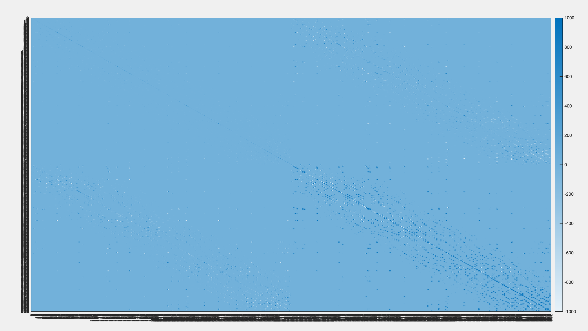
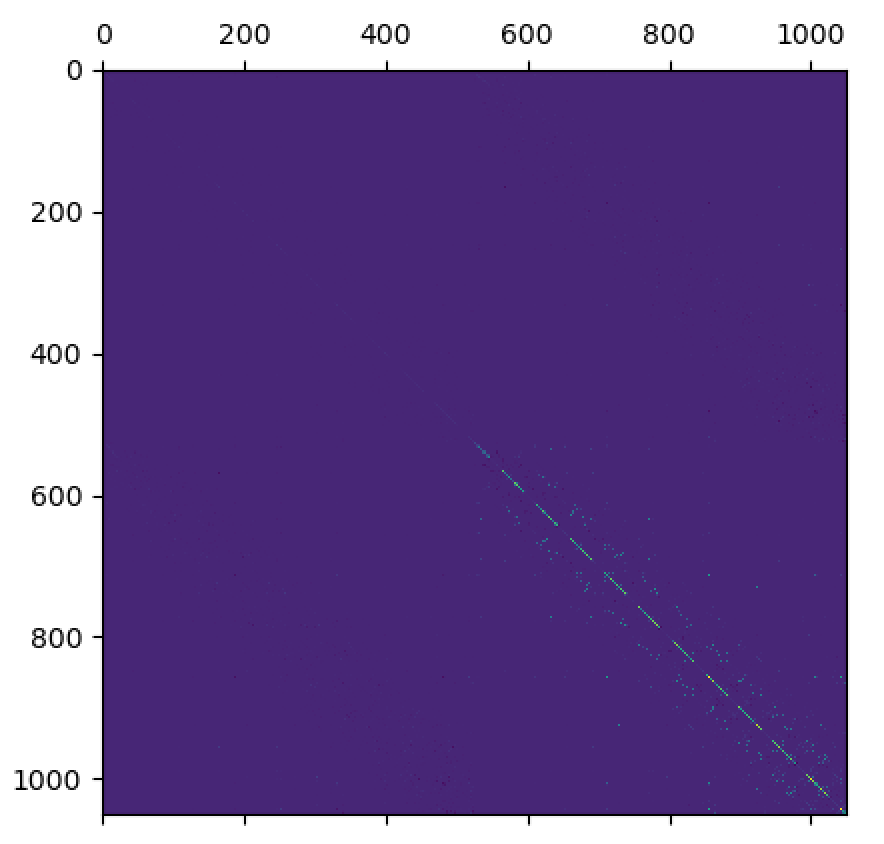

# LinearSolver

## Overview

<aside>
💡 LDLT Solver in Verilog
</aside>

## Usage

### Dependencies

### How to Run

```bash
ncverilog -f rtl.f +access+r +define+m6
```

## Features

### Already done

- based on thesis's RTL verilog codes, finish a basic version of LDLT
- NNRT's hessian matrix has sparsity after test





- C++ fixed point simulation to test error propagation → 16bit still has obvious error, especially last element of L →  not obvious error, about 1% at most on most of the data [12/26 updated]
- read doc, think architecture [12/26 updated]
- convert verilog code to serial in [12/26 updated]
- row-based baseline version LDLT using register [12/26 updated]
- sram behavioral code [12/26 updated]
- column-based baseline version LDLT using sram [12/26 updated]
- testing data generation c++ program, float to fixed to binary input/golden [12/26 updated]
- generate positive definite matrix (floating point) by Matlab [12/26 updated]
- optimization → parallel x2 [12/26 updated]
- optimization → parallel x4 [1/19 updated]

### Future Work

- sram indexing (concat data to word feasilbility) → have not try that [12/26 updated] → done with p4  [1/19 updated]
- ~~c++ more precise fixed point simulation~~ → no need [12/26 updated]
- optimization (parallelization, pipeline) → parallel x4 [12/26 updated] → done [1/19 updated]
- testbench related
    - train nnrt and get hessian data
    - ~~convert floating point hessian to fixed point~~ → DONE [12/26 updated]
    - handle positive definite
    - ~~write testbench and stream data in~~ → DONE [12/26 updated]
    - testbench error threshold [12/26 updated] → DONE [1/19 updated]

---

- consider sparse matrix (symbolic decomposition, optional)
- synthesize on smaller sram, solve smaller matrix (optional) [12/26 updated]
- try systolic array (optional)
- finish substitution part (optional)
- put on FPGA (optional)

### Ongoing Problems

- area is about n^2/2 (so store on sram) [12/26 updated]
- cycle time is about k*n^3, k is a constant (k is approximate 1/6) [12/26 updated]
- error propagation (done, is the c++ fixed point library problem)  [12/26 updated]
- will mac overflow? [12/26 updated]
- too long simulation time [12/26 updated]
- positive definite? [12/26 updated]
- want more parallel but stuck at I/O [12/26 updated]

## Related Documents

> Sparse Matrix

[稀疏矩阵 - 维基百科，自由的百科全书](https://zh.wikipedia.org/wiki/稀疏矩阵)

> Cholesky / LDLT Decomposition

[科列斯基分解 - 维基百科，自由的百科全书](https://zh.wikipedia.org/wiki/%E7%A7%91%E5%88%97%E6%96%AF%E5%9F%BA%E5%88%86%E8%A7%A3)

[[数值计算] LU分解、LUP分解、Cholesky分解](https://zhuanlan.zhihu.com/p/84210687)

[mathforcollege.com](http://mathforcollege.com/nm/mws/gen/04sle/mws_gen_sle_txt_cholesky.pdf)

> Towards a Parallel Tile LDL Factorization for Multicore Architectures

[Towards a Parallel Tile LDL Factorization for Multicore Architectures](https://hal.inria.fr/hal-00809663/document)

> Block-Cholesky for parallel processing

[Block-Cholesky for parallel processing](https://core.ac.uk/download/pdf/205788544.pdf)

> Computing the Cholesky Factorization of Sparse Matrices

[Computing the Cholesky Factorization of Sparse Matrices](https://www.tau.ac.il/~stoledo/Support/chapter-direct.pdf)

> Direct methods for sparse matrix solution

[Direct methods for sparse matrix solution](http://www.scholarpedia.org/article/Direct_methods_for_sparse_matrix_solution)

> Computing the Cholesky Factorization Using a Systolic Architecture

[Computing the Cholesky Factorization Using a Systolic Architecture](https://ecommons.cornell.edu/bitstream/handle/1813/6360/82-521.pdf?sequence=1&isAllowed=y)

> PASTIX: a high-performance parallel direct solver for sparse symmetric positive definite systems

[PASTIX: a high-performance parallel direct solver for sparse symmetric positive definite systems](https://www.labri.fr/perso/ramet/restricted/HDR_PC02.pdf)

> Verilog Code for Systolic Array Matrix Multiplier

[Verilog Code for Systolic Array Matrix Multiplier](https://asic-soc.blogspot.com/2007/10/verilog-code-for-systolic-array-matrix.html)

> FPGA Based Acceleration of Matrix Decomposition and Clustering Algorithm Using High Level Synthesis

[FPGA Based Acceleration of Matrix Decomposition and Clustering Algorithm Using High Level Synthesis](https://scholar.uwindsor.ca/cgi/viewcontent.cgi?article=6668&context=etd)

> Parallel Matrix Computations: from Systolic Arrays to Supercomputers

[Parallel Matrix Computations: from Systolic Arrays to Supercomputers](https://users.cecs.anu.edu.au/~peter/seminars/ParMatrixSA2SC.pdf)

> SYSTOLIC ARRAY FOR CHOLESKY DECOMPOSITION (PATENT)

[SYSTOLIC ARRAY FOR CHOLESKY DECOMPOSITION (PATENT)](https://patentimages.storage.googleapis.com/1d/d2/cd/0beb05065eadfb/US8443031.pdf)